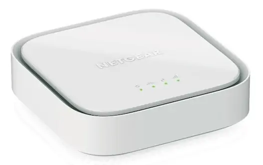

# collectd-netgearlte
Collectd plugin for Netgear LTE modems

This plugin allows [collectd](https://www.collectd.org/) to fetch data from Netgear LTE modems using the admin page over https.

Currently, only model [LM-1200](https://www.netgear.com/ie/home/mobile-wifi/lte-modems/lm1200/) has been tested, but it might work with other devices from the same family.



## Available metrics

The following metrics are collected :

 - WWAN Network traffic (if_octets)
 - Connection status (bool)
 - Radio quality (integer)
 - Frequency of current band (Mhz)
 - RSRP (dBm)
 - RSRQ (dB)

## Dependencies

This plugins require `requests` and ` beautifulsoup4` libraries. Usually `pip install requests beautifulsoup4` will do.
See [collectd-python(5)](https://ipv4.collectd.org/documentation/manpages/collectd-python.5.shtml) for more details on installation.

## Collectd configuration

Add the following snippet to your collectd configuration :

```yaml
<LoadPlugin python>
  # Unlike most other LoadPlugin lines, this one should be a block containing the line "Globals true"
  # Because it is python plugin
  # `man 5 collectd-python`
  Globals true
</LoadPlugin>

<Plugin python>
  ModulePath "/path/to/the/module/collectd-netgearlte"

  # To output python traces in syslog, set 'true'
  LogTraces true

  Import "netgear_lte"
  <Module netgear_lte>
    Verbose false
    Ip "192.168.5.1"
    Password64 "c2VjcmV0"
  </Module>

</Plugin>
```

`Password64` must be the admin password of the modem, encoded in Base64.


